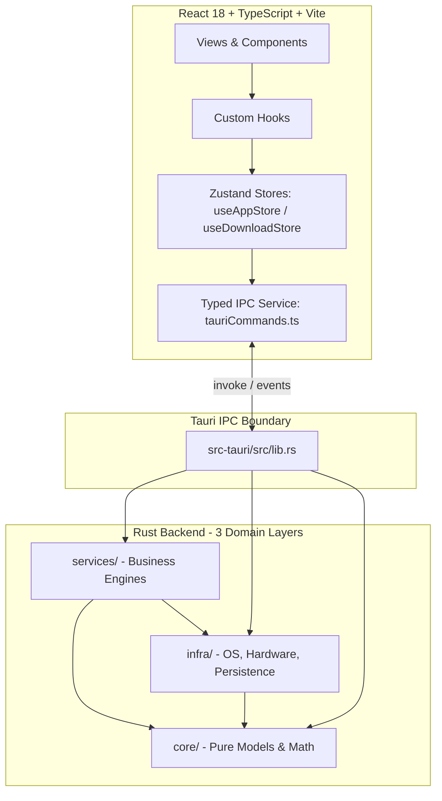

# ZZZ Mod Hub: Developer guide

> **Looking for the player guide?** See [README.md](./README.md) for end-user setup, feature documentation, and troubleshooting.

This guide covers system architecture, code conventions, local setup, and testing practices.

---

## System architecture

ZZZ Mod Hub uses **Tauri v2** with a **Rust backend** and a **React 18 + TypeScript frontend**.



### 1. Rust backend (src-tauri/src/)

The backend follows a 3-layer domain architecture with clear boundaries between subsystems:

| Layer         | Directory           | Purpose                                                       | Key modules                                                                                                                          |
| :------------ | :------------------ | :------------------------------------------------------------ | :----------------------------------------------------------------------------------------------------------------------------------- |
| **Interface** | `lib.rs`, `main.rs` | Tauri setup, plugin lifecycle, IPC dispatcher, public facades | `run()`, `generate_handler![]`                                                                                                       |
| **Services**  | `services/`         | Business engines, mod processing pipelines, remote sync       | `install`, `mod_viewer`, `ui_generator`, `mod_fixer`, `mod_splitter`, `warnings_scanner`, `gamebanana`, `mods`, `sync`               |
| **Infra**     | `infra/`            | OS integrations, hardware APIs, file watchers, persistence    | `fs_ops`, `game_ops`, `ini_ops`, `watcher`, `thumbnail_cache`, `state_tracker`, `hotreload`, `screenshot`, `hunting`, `task_manager` |
| **Core**      | `core/`             | Pure models, typed errors, low-level binary and hashing math  | `error.rs`, `models.rs`, `utils.rs`                                                                                                  |
| **CLI tool**  | `bin/zmm_cli.rs`    | Headless diagnostic and validation CLI tool (`zmm-cli`)       | `verify-mods`, `verify-mod`, `health-check`                                                                                          |

### 2. Frontend architecture (src/)

- **Component domains** (`src/components/`):
  - `modCard/`: Mod card orchestrator, badges, actions menu, editable notes.
  - `navigation/`: App sidebar, active download queue panel.
  - `gamebanana/`: Discover feed, mod preview cards, category tree.
  - `library/`: Batch action bar, search headers, category banners.
  - `ModViewer/`: WebGL / Three.js 3D model viewer with PBR multi-map shading.
  - `Modals/`: Portaled dialogs for renaming, conflicts, version upgrades, script fixes.
  - `layout/`: App header toolbar, theme provider, background engine, drop overlay.
- **State management** (`src/store/`):
  - `useAppStore.ts`: Global application state composed of modular Zustand slices (`librarySlice`, `diagnosticsSlice`, `preferencesSlice`, `profilesSlice`, `statsAchievementsSlice`).
  - `useDownloadStore.ts`: GameBanana download queue, active progress, and download history.
- **Type-safe IPC boundary**:
  - `src/types/ipc.ts` mirrors Rust structs (using `snake_case` serialization) for full type safety.
  - `src/services/tauriCommands.ts` provides compile-time validated wrappers for all `invoke()` calls.

---

## Core architectural invariants

When contributing to this project, adhere strictly to these invariants:

1. **Strict hash authority and zero name-based routing**:
   - All mod identification, character routing, and component resolution must rely on 3DMigoto buffer hashes (`ib`, `vb`, `texture`).
   - Never use folder names, archive filenames, or internal strings to tiebreak, guess, or search for target folders.
   - If hashes are missing, ambiguous, or below threshold, always route the mod to `Unassigned`. False negatives are safe and user-correctable; false positives corrupt libraries.
2. **Panic safety (zero unwrap in production)**:
   - Never call `.unwrap()` or `.expect()` in production backend code.
   - Always propagate errors using typed `AppError` enum variants (`src-tauri/src/core/error.rs`) and the question-mark operator.
3. **Portaled modals and overlays**:
   - Every modal dialog, tooltip popup, or context menu must use `<Modal>` / `<ModalPortal>` (`src/components/ui/Modal.tsx`) or `createPortal(..., document.body)`.
   - Never render inline fixed overlays, which break when parents have CSS transforms or filters.
4. **Complete internationalization (i18n)**:
   - Every user-facing UI string must exist in `src/locales/en.json` before shipping.
   - Never use bare fallback strings in JSX.
5. **Procedural audio (zero audio assets)**:
   - UI sound effects are synthesized in `src/utils/audio.ts` via the Web Audio API. No audio files are stored in the repository.

---

## Developer setup and commands

### Prerequisites

- **Node.js**: v20 or newer (`npm` v10+)
- **Rust**: Latest stable (`rustup default stable`) with `clippy` and `rustfmt`
- **C++ build tools**: Visual Studio 2022 C++ Build Tools (on Windows)

### Installing dependencies

```bash
# Clone the repository
git clone https://github.com/<owner>/ZZZ-Mod-Hub.git
cd ZZZ-Mod-Hub

# Install dependencies (configures Husky pre-commit hooks automatically)
npm install
```

### Running locally

```bash
# Run the desktop app in development mode
npm run tauri dev

# Run only the frontend dev server (with mocked IPC for UI testing)
npm run dev
```

### Verification and quality checks

Before submitting a pull request, run the verification commands:

```bash
# 1. Full frontend preflight (TypeScript, Vitest, i18n completeness, modal portals)
npm run check

# 2. Rust Clippy (Zero warnings enforced)
cargo clippy --manifest-path src-tauri/Cargo.toml --all-targets -- -D warnings

# 3. Rust unit and integration test suite
cargo test --manifest-path src-tauri/Cargo.toml

# 4. Headless database and rule health check
cargo run --manifest-path src-tauri/Cargo.toml --bin zmm-cli -- health-check
```

---

## Testing strategies

- **Frontend unit tests**: Run via `npm test` (using Vitest in `src/**/__tests__/`). IPC invocations are mocked in `src/test/mockIpc.ts`.
- **Backend unit tests**: Embedded inside Rust modules under `#[cfg(test)] mod tests;` or dedicated test files like `mod_fixer_tests.rs`.
- **End-to-end integration tests**: Located in `src-tauri/tests/integration_pipeline.rs`, exercising real mod archives and character fixtures in `src-tauri/fixtures/`.

---

## Further reading

- [CODEMAP.md](./CODEMAP.md): Directory and module catalog.
- [CONTRIBUTING.md](./CONTRIBUTING.md): Branch conventions, code style, and pull request checklist.
- [.agents/skills/rust-skills/SKILL.md](./.agents/skills/rust-skills/SKILL.md): 265 Rust coding guidelines across 26 categories.
